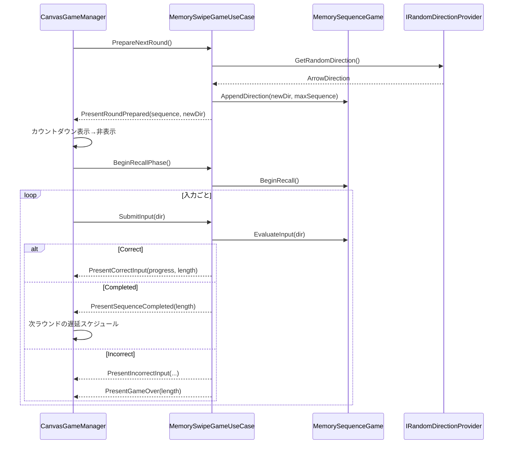
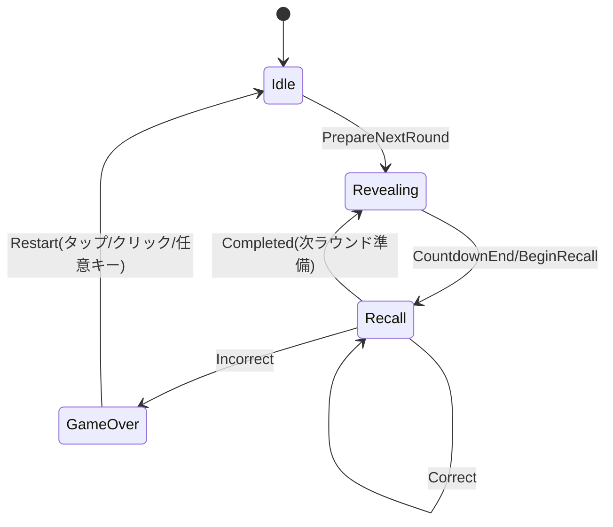

# Memory Swipe Game 仕様書

本書は、Unity 実装「MemorySwipeGame」の外部仕様（振る舞い、入出力、UI、ステート、パラメータ、拡張点）をまとめたものです。実装の主要スクリプトは `Assets/Scripts/MemorySwipeGame/` 配下にあります。

## 目的 / 概要
- プレイヤーは、表示（提示）された矢印方向のシーケンスを記憶し、同じ順番でスワイプ入力して再現する。
- 1 ラウンドごとにシーケンスの末尾へ新しい方向が 1 つ追加される。正しくすべて再現できれば次ラウンドへ進む。間違えるとゲームオーバー。
- 再開はタップ/クリック/任意キーで可能。

## アーキテクチャ
- レイヤ分離（アプリケーション / ドメイン / インフラ / プレゼンテーション）。
- 依存方向は UI→UseCase→Domain、乱数は抽象化して差し替え可能。

```mermaid
flowchart LR
  UI[CanvasGameManager (Presenter, Input/UI)] --> UC[MemorySwipeGameUseCase]
  UC --> D[MemorySequenceGame (Domain)]
  UC --> R[IRandomDirectionProvider]
  R --> UR[UnityRandomDirectionProvider]
```

主要構成:
- UseCase: `Assets/Scripts/MemorySwipeGame/Application/MemorySwipeGameUseCase.cs`
- Domain: `Assets/Scripts/MemorySwipeGame/Domain/MemorySequenceGame.cs`
- Presenter IF: `Assets/Scripts/MemorySwipeGame/Application/IMemoryGamePresenter.cs`
- Random IF/Impl: `Assets/Scripts/MemorySwipeGame/Application/IRandomDirectionProvider.cs`, `.../Infrastructure/UnityRandomDirectionProvider.cs`
- UI/入力/表示: `Assets/Scripts/MemorySwipeGame/CanvasGameManager.cs`
- UIコンポーネント: `Assets/Scripts/MemorySwipeGame/RawImageArrowController.cs`
- 入力ヘルパ: `Assets/Scripts/MemorySwipeGame/SwipeUtils.cs`
- 方向定義: `Assets/Scripts/MemorySwipeGame/ArrowDirection.cs`
- 評価結果: `Assets/Scripts/MemorySwipeGame/Domain/SequenceEvaluation.cs`

## ゲームルールとラウンドの流れ
1. ラウンド準備
   - 乱数で新しい方向を 1 つ生成し、シーケンス末尾に追加（最大長を超えると先頭を削除）。
   - UI には「最新の 1 つのみ」を一時表示し、カウントダウン（3,2,1,GO!）後に非表示へ戻す。
2. 再現（Recall）フェーズ
   - プレイヤーは提示順にスワイプ入力。正解なら進捗が 1 つ進む。
   - すべて正解するとラウンド完了（Completed）。短い遅延後に次ラウンド準備へ。
   - 1 つでも間違えるとゲームオーバー。
3. ゲームオーバー
   - 画面に「Game Over」を表示。タップ/クリック/任意キーで新規ゲーム開始。

シーケンス図（1 ラウンド）:


## ステートマシン（論理）


- Idle: 初期化直後の待機。実装では直ちに準備を呼び出す。
- Revealing: 最新の矢印 1 つを表示しカウントダウン。
- Recall: 入力受付。正解で進捗、全件一致で Completed。
- GameOver: 入力ロック、全カーソル表示、リスタート待ち。

## 入力仕様
- デバイス: 新 Input System のタッチ/マウスを使用（ドラッグ開始/終了で delta を取得）。
- 方向判定: `SwipeUtils.GetDirectionFromDelta(delta, deadZonePixels)`
  - `|delta| < deadZonePixels` は `None`（無視）。
  - 絶対値が大きい軸で左右/上下に量子化。
- 入力ロック: 提示中（カウントダウン）/ゲームオーバー時は UI レベルで無視。さらに Domain でも Recall 非アクティブ・GameOver・空シーケンスのときに Ignored を返す。

## UI 仕様
- 矢印表示:
  - `RawImageArrowController` が素材の回転で方向を表現。
  - 回転値: Down=0°, Up=180°, Left=-90°, Right=90°。
- レイアウト:
  - 最新（末尾）は中央、履歴は下側へ縮小配置（行折り返し・横間隔自動計算）。
  - カーソル数はシーケンス長に追従して増減。
- カウントダウン:
  - 「3, 2, 1, GO!」を `countdownIntervalSeconds` 間隔で表示。
  - GO! の瞬間に最新矢印を非表示→Recall 開始。
- デバッグ UI:
  - 画面左上ボタンで「全カーソル表示」のトグル。
  - 状態/進捗/（エディタ時のみ）最後のスワイプ方向のラベル表示。

## パラメータ一覧（CanvasGameManager）
- Layout
  - `circleSpacing`: 150
  - `centerOffset`: (0,0)
  - `maxSequence`: 50
  - `historyRowYOffset`: -220
  - `historyScale`: 0.5 (0.1〜1.0にクランプ)
  - `historyRowLineSpacing`: -140
  - `historyRowHorizontalPadding`: 80
  - `historyItemExtraGap`: 10
- Gameplay
  - `inputDeadZonePixels`: 40
  - `nextRoundDelaySeconds`: 0.75
  - `countdownIntervalSeconds`: 0.5
  - `countdownText`: `TMP_Text` 参照（未設定時は非表示で進行）
- Prefab
  - `cursorPrefab`: カーソルのプレハブ（RawImageArrowController をもつ）

## データモデル / API
- ArrowDirection（列挙）: `None, Up, Down, Left, Right`
- SequenceEvaluation（値型）:
  - `State`: `Correct | Completed | Incorrect | Ignored`
  - `SequenceLength`, `Progress`, `Expected`, `Received`
- UseCase（公開メソッド）:
  - `SetPresenter(IMemoryGamePresenter)`
  - `ResetGame()`
  - `PrepareNextRound()`
  - `BeginRecallPhase()`
  - `SubmitInput(ArrowDirection) : SequenceEvaluation`
  - 読取プロパティ: `CurrentSequence`, `IsRecallActive`, `IsGameOver`
- Domain: MemorySequenceGame（公開メソッド）
  - `Reset()`, `AppendDirection(dir, max)`, `BeginRecall()`, `PeekExpectedDirection()`, `EvaluateInput(dir)`
- Presenter IF: IMemoryGamePresenter
  - `PresentGameReset()`, `PresentRoundPrepared(sequence, newest)`, `PresentRecallReady(length)`,
    `PresentCorrectInput(progress, length)`, `PresentSequenceCompleted(length)`,
    `PresentIncorrectInput(expected, received, progress, length)`, `PresentGameOver(length)`
- RNG IF/Impl: IRandomDirectionProvider / UnityRandomDirectionProvider

## エラー処理 / エッジケース
- Prefab 未設定・Canvas 未検出: ログで通知（Instantiate はフォールバック）。
- カウントダウン参照未設定: カウントダウン表示はスキップ（ゲーム進行は継続）。
- タスクのキャンセル: 提示/次ラウンド遅延は `CancellationTokenSource` で中断可。
- 最大長超過: 古い要素から切り捨て（スライディングウィンドウ）。
- 入力無視: Recall 非アクティブ／GameOver／空シーケンス時は Ignored。

## 品質特性 / 拡張方針
- 差し替え可能な RNG（難易度調整や事前定義パターンの再生）。
- Presenter の実装置換（Canvas → 3D 表示、VR など）。
- フィードバックの強化（SE/アニメーション/ミス時のハイライト）。
- 難易度調整（デッドゾーン、カウントダウン速度、連続提示への変更など）。

## テスト項目（例）
- Domain 単体
  - 正解入力で `Correct`、最終入力で `Completed`。
  - 誤入力で `Incorrect` かつ `IsGameOver=true`。
  - Recall 非アクティブ/空シーケンスで `Ignored`。
  - `maxSequence` 越え時に先頭が削除される。
- UseCase/Presenter 連携
  - `PrepareNextRound` で Presenter に `PresentRoundPrepared` が届く。
  - `BeginRecallPhase` で `PresentRecallReady` が届く。
  - 評価結果に応じた Presenter 呼び分け（Correct/Completed/Incorrect+GameOver）。
- UI
  - カーソルの生成/破棄・レイアウトの行折り返し。
  - カウントダウン中の入力ロック、GO! 後の解除。

## 統合/実行メモ
- 任意の GameObject に `CanvasGameManager` をアタッチ。
- `cursorPrefab` と `countdownText`（任意）をインスペクタで設定。
- Unity Input System を有効化（Touch/Mouse）。

---
このドキュメントはコードと同期されるよう設計されています。仕様変更時は本書も更新してください。

